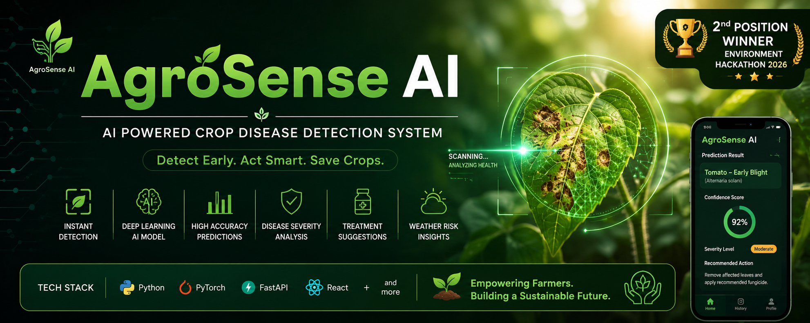
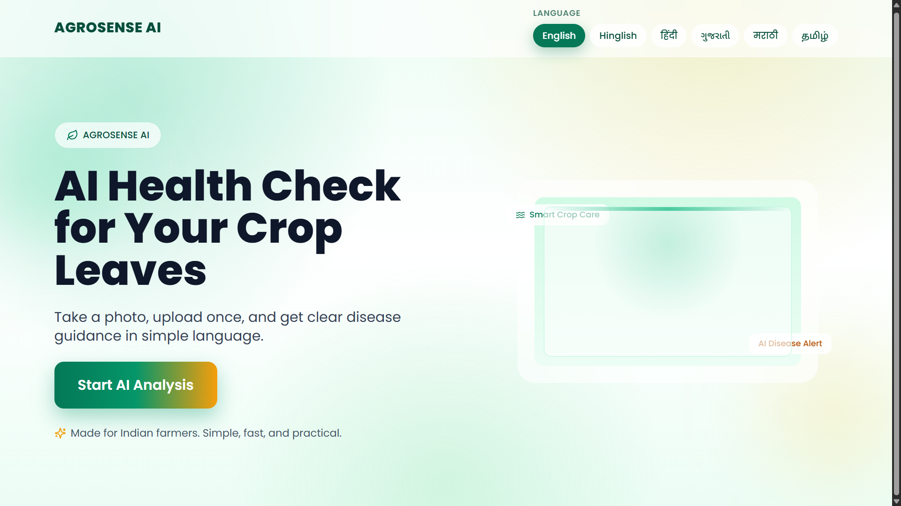
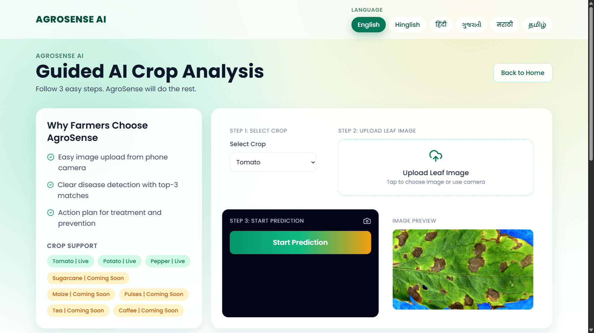
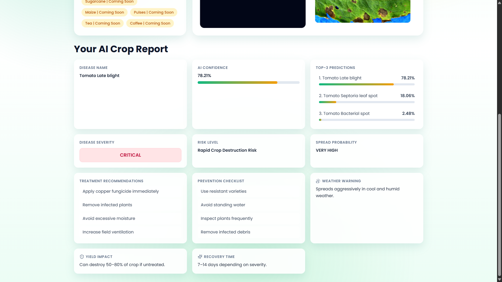

# 🌱 AgroSense AI – Crop Disease Detection System

  <p align="center">
  
  </p>

  <p align="center">


</p>

## 🏆 2nd Position Winner – Environment Hackathon 2026

> AI-powered crop disease detection platform using Deep Learning (PyTorch) and FastAPI with a modern React frontend for real-time agricultural diagnosis.

---


## 🏅 Why AgroSense Stands Out

- Ranked **2nd position** in a competitive Environment Hackathon
- Built under strict time constraints (5 days)
- Real-world AI application for farmers
- End-to-end full-stack deployment (AI + Backend + Frontend)
- Designed for sustainability and SDG goals

🟢 Competition-tested
🟢 Jury-evaluated
🟢 Award-winning
🟢 Production-style system


## 🚀 Project Overview

AgroSense AI is an intelligent crop disease detection system designed to help farmers and agricultural experts identify plant diseases instantly using leaf images.

The system uses a **MobileNetV2 deep learning model** trained on the PlantVillage dataset to classify diseases and provide actionable insights like:

- Disease name
- Confidence score
- Severity level
- Risk assessment
- Treatment recommendations
- Prevention guidelines

---

## 🧠 Key Features

- 📸 Upload crop leaf images for instant prediction
- 🌿 Detect multiple crop diseases (Tomato, Potato, Pepper, etc.)
- 🤖 AI-powered disease classification using CNN (MobileNetV2)
- 📊 Confidence score & top-3 predictions
- ⚠️ Disease severity & risk analysis
- 💊 Treatment & prevention suggestions
- 🌦️ Weather-based risk insights
- ⚡ FastAPI backend for real-time inference
- 🌐 React-based interactive frontend

---

## 📸 Application Preview

### 🏠 Home Page

<p align="center">

</p>

### 📷 Upload Page

<p align="center">

</p>

### 🤖 AI Disease Report

<p align="center">

</p>
---
---

## 🏗️ System Architecture
```text
Frontend (React)
↓
FastAPI Backend
↓
PyTorch Model (MobileNetV2)
↓
PlantVillage Dataset (Training Source)
↓
Prediction Engine
↓
AI Crop Disease Report

```

---

## 🧪 Tech Stack

### AI / ML


- PyTorch
- Torchvision
- MobileNetV2
- CNN (Convolutional Neural Networks)

### Backend
- FastAPI
- Python
- Pillow (PIL)

### Frontend
- React.js
- JavaScript
- HTML/CSS

### Tools
- Git & GitHub
- VS Code
- Jupyter Notebook
- Nvidia CUDA Toolkit


---

## 📊 Model Details

- Architecture: MobileNetV2 (Transfer Learning)
- Framework: PyTorch 
- Dataset: PlantVillage Dataset
- Input Image Size: 224 × 224
- Output: Multi-class disease classification
- Optimized for real-time inference

---

## 📁 Project Structure
```text
AgroSense-AI/
│
├── backend/
│ ├── main.py
│ ├── predictor.py
│ ├── model_loader.py
│ ├── disease_data/
│ └── disease_info.py
│
├── frontend/
├── models/
├── data/
├── sample_images/
└── README.md

```

---

## ⚙️ How to Run Locally

### 1. Clone repository
```bash
git clone https://github.com/eshant1008/AgroSense-AI.git
cd AgroSense-AI
```

### 2. Setup Backend
```bash
cd backend
pip install -r requirements.txt
uvicorn main:app --reload
```

### 3. Setup frontend
```bash
cd frontend
npm install
npm run dev
```

📸 Sample Output

- Disease detection report
- AI confidence score
- Top-3 predictions
- Treatment suggestions

🎯 Real-World Impact

- 🚜 Helps farmers detect diseases early
- 📉 Reduces crop loss significantlys
- 🏆 Recognized in a university-level hackathon for real-world impact and innovation
- 🌾 Improves agricultural productivity
- 🌱 Supports sustainable farming practices
- 🤖 Can be extended to IoT-based smart farming systems

👨‍💻 Team
- Eshant Bhardwaj – Backend, Deep Learning, Model Development
- Gaurav Sharma – Frontend, UI/UX, React Development


🚀 Future Improvements
- Multi-crop generalization model
- Mobile app version (Android/iOS)
- 🌦️ Weather API integration
- Explainable AI (XAI) for predictions
- ☁️ Cloud deployment (AWS / Azure)


📜 License

This project is for educational and hackathon purposes.


⭐ If you like this project

Give it a ⭐ on GitHub to support the project!